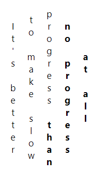
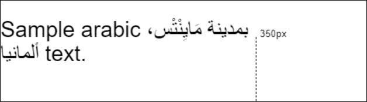

Formatted Text - Input Data Model
=============
The input object model that describes multi-line formatted text before it is shaped and formatted.
The input consists of text (from JavaScript strings), text metadata (e.g., for internationalization),
and text formats/style. Formatted text scenarios involve both document and non-document (Worker)
scenarios and thus have no dependency on DOM Text nodes or Elements.

This explainer focuses on the input data model for formatted text. The output is captured in 
a separate explainer for [formatted text metrics](explainer-metrics.md). The metrics can also
be [rendered](explainer-rendering.md) if desired. For a general overview of the problem space,
see the [readme](README.md).

## Providing an input model for formatted text

On the web today, to render text there are two general options: use the DOM (HTML's 
`CharacterData`/`Text` nodes or SVG Text-related Elements), where text is collected in the
document's "retained" mode infrastructure; the web platform decides when and how to compose and
render the text with declarative input from you (in the form of CSS); or you can use Canvas and
"write" the text when and how you want with JavaScript (an "immediate" mode approach). Canvas
provides very limited text support today and (by design) leaves any special formatting, text
wrapping, international support, etc., up to the JavaScript author.

Of principal interest to most text-based scenarios is not the data model itself--that is,
*applications will already have an existing data model*, and because these applications interface
with the web, they use JavaScript primitives at some point to express their text. A secondary 
"retained" data model specified just for this feature is unnecessary. Instead of creating platform
objects to retain a data model for incremental updates, this feature only requires that existing
JavaScript strings be structured and input into a "formatter" operation in a particular structure 
in order to get to what is really important: [the output text metrics](explainer-metrics.md).

In this explainer, the input structure for formatting text is presented along with a simple structure
for creating reusable formatting.

### Principles
* Enable re-use of existing application string data.
* Scope formatting to the needs of inline text layout.
* Leverage CSS as the universal text layout system for the web (even in an imperative model) which 
    also provides for future extensibility.
* Avoid multi-level hierarchal text structures (which ultimately must be linearly iterated for 
    rendering)
* Object-centric model (versus range+indexes) to improve encapsulation and avoid problems with 
    overlapping formatting.
* Extensibility for internationalization hints and reserved future scenarios.

## Formatting text (`FormattedText.format`)

The data model comprises the parameters to the operation `format` which takes the input data model
and produces output [text metrics](explainer-metrics.md) (`format` is a static method of the
`FormattedText` constructor). The input consists of:

1. text or an array of text
2. metadata/ style for all the text
3. constraints for the formatting process

Each of these is explained in more detail below.

### Expressing text

Text can be expressed as JavaScript strings, or as a JavaScript object with property named
`text` that has a JavaScript string as its value.

```js
// The following representations of text are equivalent:
FormattedText.format( "hello" );
FormattedText.format( { text: "hello" } );
```

Text can also be expressed in separate runs (which are concatenated together when formatted)
when wrapped in an Array. The following are equivalent:

```js
// The following text runs are equivalent:
FormattedText.format( [ "hello", " world!" ] );
FormattedText.format( [ { text: "hello" }, { text: " world!" } ] );
```

### Adding some style

Style for *all the text* (general styles) are provided via the second parameter to `format`.
Style input uses the same syntax as Element inline styles 
(i.e., `<span style="style text syntax">`) and is ultimately parsed with the same CSS parser.
The following formatted text outputs will all be blue:

```js
FormattedText.format( "hello world!", "color: blue" );
FormattedText.format( [ "hello", " world!" ], "color: blue" );
FormattedText.format( [ { text: "hello" }, { text: " world!" } ], "color: blue" );
```

Like text, style strings can be wrapped in a JavaScript object with property named `style` that 
has the style text string as its value. The following are equivalent:

```js
// The following are equivalent expressions of style:
FormattedText.format( "hello world!", "color: blue" );
FormattedText.format( "hello world!", { style: "color: blue" } );
```

### Styling specific text runs

If specific text runs need to override or have specific style values, then style can also be
added to the object-form of a text run. In this example, the word "brown" will be colored
brown and bold and all the text will be italic:

```js
FormattedText.format( [ "The quick ", 
                        { text: "brown", style: "color: brown; font-weight: bold" },
                        " fox jumps over the lazy dog." 
                      ], "font-style: italic" );
```

And in the following example, all the text will be blue _except_ for the word brown, which
will be colored brown:

```js
FormattedText.format( [ "The quick ", 
                        { text: "brown", style: "color: brown" }, 
                        " fox jumps over the lazy dog."
                      ], { style: "color: blue" } );
```

A wide range of inline layout-related CSS is supported as style input to the `format` API.

Styles specified in the second parameter apply to all text runs except where overridden on
individual text objects (in the first parameter).

### Specifying constraints

The final input to `format` are any constraints that should be applied to the formatted text.
The primary constraints of interest to the API are the width and height of the containing block:
how many CSS pixels are available for text layout.

The layout flow will follow any writing-mode direction specified in the meta object, so in
`horizontal-lr` (e.g., English) a width constraint on the containing block will cause line 
wrapping in the inline direction; overflow will occur in the vertical direction. For specified 
writing-modes such as `vertical-rl` (e.g., Chinese) a width constraint on the containing block 
will only affect where overflow occurs--the line will not wrap because it is assumed to have 
infinite vertical space to layout. To cause wrapping with `vertical-rl` writing modes, specify
a height constraint instead.

Constraints are specified on a constraint object using a `width` or `height` property:

```js
// Wrap any text that exceeds 150 pixels
FormattedText.format( "The quick brown fox jumps over the lazy dog.", null, { width: 150 } );
```

`width` and `height` are `unsigned long` values. Omitted values are assumed to be infinite.

**Note**: [Issue 43: What should constraining the block-progression direction do?](https://github.com/WICG/canvas-formatted-text/issues/43) tracks an unresolved issue about allowing constraints in both directions.

## Comparison to HTML

`format` is used to drive the web platform's layout engine, but using the JavaScript-based data
model described above. Therefore, the output of `format` should be the equivalent to what can be
already performed in HTML using simple elements like `div` and `span`. The following two expressions
are functionally equivalent, with the exception that the result of `format` has not been rendered
(and thus can't be visualized yet):

```js
FormattedText.format( [ "The quick ",
                        { text: "brown", style: "color: brown; font-weight: bold" },
                        " fox jumps over the lazy dog"
                      ], null, { width: 150 } );
```

```html
<div style="width:150px">
  <span id="meta_object">
    The quick <span style="color: brown; font-weight: bold">brown</span> fox jumps over the lazy dog
  </span>
</div>
```

Above, the `<div>` element is the container for an inline formatting context which sets the 
inline wrapping width, and the `<span id="meta_object">` gets any meta object styling (in this
case, nothing), and contains the formatting for the text runs. The text run styles on the word
"brown" are applied to its immediate containing span. More precisely: since each text object
in the array has the potential to be styled, the following markup better represents 
the semantic equivalent:

```html
<div style="width:150px">
  <span id="meta_object">
    <span>The quick </span>
    <span style="color: brown; font-weight: bold">brown</span>
    <span> fox jumps over the lazy dog</span>
  </span>
</div>
```

Another illustrative comparison shows how style on the meta object provided to `format` could be
visualized:

```js
FormattedText.format( [ "The quick ", 
                        { text: "brown", style: "color: brown" }, 
                        " fox jumps over the lazy dog."
                      ], { style: "color: blue" } );
```

```html
<div>
  <span id="meta_object" style="color: blue">
    <span>The quick </span>
    <span style="color: brown">brown</span>
    <span> fox jumps over the lazy dog</span>
  </span>
</div>
```

## CSS to achieve advanced scenarios

### Vertical Text

By leveraging existing CSS styles for writing modes and other related properties,  
`format` can support a variety of vertical text scenarios. For example, by simply
leveraging the `writing-mode` property we can orient text in its traditional vertical
direction:

```js
let bold = "font-weight: bold";
let meta = "writing-mode: vertical-rl; font-size: 36pt";
FormattedText.format( [ "不怕慢，", { text: "就怕站", style: bold ], meta, { height: 200 } );
```

[When rendered](explainer-rendering.md), and height-constrained as indicated, this will render as:


In combination with other related CSS properties, many other vertical text layouts are
possible:

```js
let bold = "font-weight:bold";
let styles  = "writing-mode: vertical-lr;";
    styles += "text-orientation: upright;";
    styles += "line-height: 2;";
    styles += "text-align: center;";
    styles += "font-size: 12pt";
FormattedText.format( [ "It's better to make slow progress", 
                        { text: " than no progress at all", style: bold }
                      ], styles, { height: 250 } );
```

This might render as:



### Reusing styles (`FormattedTextStyle`)

When style text strings are passed to the `format` function, they must be parsed into
CSS properties (including verifying valid syntax). This process is usually fast but not
free. It is likely that when preparing to format many text strings, or when repeatedly 
calling `format` in performance critical code paths, there are opportunities to re-use 
sets of CSS styles as a unit.

A new write-once object is introduced to collect and cache these styles. It makes use
of a [StylePropertyMapReadOnly](https://drafts.css-houdini.org/css-typed-om/#stylepropertymapreadonly)
to reflect the parsed values for read-only inspection following construction:

```js
// Save the upright text styles from the previous example for later re-use
let styles = new FormattedTextStyle( "writing-mode: vertical-lr;" +
                                     "text-orientation: upright;" +
                                     "line-height: 2;" + 
                                     "text-align: center" );
styles.styleMap.has( "text-orientation" ); // returns true
styles.styleMap.size; // returns 4, the number of declarations in the map
for ( let [prop, val] of styles ) { // Enumerate everything in the map
   console.log( `${prop}: ${val}` );
}
```

The `FormattedTextStyle` object can be used in all the places in the data model that
accept a style text string. For example the following are equivalent:

```js
let bold = "font-weight: bold";
let vertical = "writing-mode: vertical-rl";
FormattedText.format( [ "不怕慢，", { text: "就怕站", style: bold ], vertical );

let reusableBold = new FormattedTextStyle( "font-weight: bold" );
let reusableVertical = new FormattedTextStyle( "writing-mode: vertical-rl" );
FormattedText.format( [ "不怕慢，", { text: "就怕站", style: reusableBold ], reusableVertical );
```

### How much CSS should be supported?

The `format` function support various CSS properties that influence how the text's lines
will ultimately be positioned. There are also many CSS properties that do not apply to text,
that convert between typical text layout and other layouts, or that take normal flow content 
out of flow (e.g., `float`, `position`, `display`, etc.). For the purposes of a formatted 
text object model, not all CSS properties can or should be supported. The guidelines for
what CSS to support and what not to support follow.

### Focus on text-related CSS properties

We believe it makes sense to only support CSS properties that provide specific features
for inline-level content (text) and the management of the text's container (the metadata
parameter). Other properties, especially those that would change the layout characteristics 
of text objects from their assumed inline-level nature, will not be supported. In the data
model we keep the semantics of text runs consistent with the CSS that can be applied.

Applying the above principle means that `float` would not
be supported because it has the effect of changing the object's computed display value 
from inline to block (taking it out-of-flow). `position: absolute` as a metadata property also takes
the object out of the normal flow. Likewise, the `width` and `height` properties on specific text runs would
be ignored because they do not apply to inline-level elements. Attempting to set these 
properties would have no effect. On the other hand, `padding` **would be supported** and 
applied to text runs in accordance with the rules of CSS inline layout,
e.g., the inline-direction `padding` values are taken into account while the 
block-direction values are not.

The container for text runs is an independent containing block. It is essentially a 
`display: flow-root` object that establishes an inline formatting context for its children.
When used in the metadata parameter, properties like `top`, `right`, `bottom`, and `left` do
not apply (i.e., the text run container acts as its own initial containing block). Positioning
the resulting formatted text for the purpose of rendering in some context must be done separately.

In some cases, we imagine it will be useful to allow `format` metadata properties to support 
some limited alternate layout container types where those alternate types provide unique text layout
capabilities. For example, we expect to support an inner display type of `ruby` in order to 
become a Ruby container and enable the use of Ruby annotated layout. Other container types are
not currently planned to initially support 
but are good long-term candidates (e.g., multi-column containers created via the `columns`
shorthand property), while still others are less-likely to be supported (e.g., `flex` and 
`grid` container types, which are less useful for formatted text scenarios).

There are various CSS properties that provide helpful graphical emphasis to text that are 
also supported. These are for convenience in supporting common text formatting scenarios
that would otherwise require detailed introspection of the object model's related metrics
in order to correctly layout and render as desired with respect to the text. Because these
features are already available in CSS layout engines and significantly ease author burden, 
many of these CSS properties will be supported. Some supported examples include: 
`text-decoration`, `text-shadow`, `box-shadow`, even `border`, `outline`, and limited `background` support 
(where the metrics and composition processing do not require external dependencies, such as 
image resources typically loaded by `url()` functions).

### Future extensions 

By leveraging CSS, we get the added benefit of a well-known constraint language for 
expressing box bounds and the expected behavior for content (in our case formatted text 
content) that overflows those bounds. `width` and `height` and corresponding `min-width`
or `max-height` properties express the desired constraints for eventual line-box 
computation when it comes to rendering the object model or returning metrics. Similarly,
`overflow` and `clip-path` can further ensure the text content expands or is clipped to
fit the desired constraints. These properties would only apply in the metadata parameter
of `format`.

CSS continues to evolve, and it makes sense to extend relevant new CSS properties to
this object model as they become a part of the web platform. For example, while not
widely supported at the time of writing, support for `shape-inside` (CSS Shapes L2)
and CSS Exclusions provide exciting growth opportunities for text using this model.

## Internationalization

CSS provides various existing properties for handling internationalization of text, such
as `writing-mode`, `direction`, `unicode-bidi`, and others. However, it does not have a
property for expressing language (CSS Selectors provide `:lang(xx)` but this is not a 
property).

Therefore, all text objects (and metadata objects) will support an optional `lang` property
whose value will accept the set of supported values of the equivalent HTML `lang` attribute
(or XML/XHTML `xml:lang` attribute).

An example where the `lang` property is used to provide clarify on the text object directly:

```js
FormattedText.format( { text: "不怕慢就怕站", lang: "zh-CN" } ); 
```

Or it can be applied to the metadata object (generally the preferred option unless there
are multiple text runs of differing language):

```js
FormattedText.format( [ "不怕慢", "就怕站" ], { lang: "zh-CH", style: "color: red" } );
```

### Bidi Text

No additional work is needed from web developers to support bidi text. At `format` time,  bidi
analysis is done on the input text which creates internal bidi runs if necessary. For example:

```js
FormattedText.format( "Sample arabic بمدينة مَايِنْتْس، ألمانيا text.", "font: 30px Arial", { width: 350 } );
```

Might produce the following rendered output:



## WebIDL

```webidl
[Exposed=Window,Worker] 
interface FormattedText { 
  static FormattedText format( ( DOMString or FormattedTextRun or sequence<( DOMString or FormattedTextRun )> ) text,
                               optional ( DOMString or FormattedTextStyle or FormattedTextMetadata ) metadata,
                               optional FormattedTextConstraints constraints );
};

[Exposed=Window,Worker] 
interface FormattedTextStyle {
  constructor( ( DOMString or StylePropertyMapReadOnly or CSSStyleDeclaration ) styleText );
  [SameObject] readonly attribute StylePropertyMapReadOnly styleMap;
};

dictionary FormattedTextMetadata { 
  ( DOMString or FormattedTextStyle) style;
  DOMString lang;
}; 

dictionary FormattedTextRun : FormattedTextMetadata { 
  DOMString text = "";
}; 

dictionary FormattedTextConstraints {
  unsigned long width;
  unsigned long height;
};
```

## Supported CSS Table

We've compiled a list of text-related (or generally applicable) CSS properties that we believe make
sense to support on metadata and text objects. This list is not exhaustive.
For example, it does not include many of the new logical properites such as `inline-size` for 
`width`. This list is provided for potential testing purposes and to facilitate discussion.

| CSS Property | metadata object | text object | inherits | Notes |
|--------------|---------------|------------------|----------|-------|
| background | ✔ | ✔ | no | background-attachment, background-origin, background-position, background-repeat, background-size operate on an external resource image and will be ignored. Background-image will only support `<gradient>` functions |
| border | ✔ | ✔ | no |  |
| border-image | ✔ | ✔ | no | border-image-source will only supports `<gradient>` functions |
| border-radius | ✔ | ✔ | no |  |
| box-decoration-break | ✔ | ✔ | no |  |
| box-shadow | ✔ | ✔ | no |  |
| box-sizing | ✔ |  | no |  |
| clip-path | ✔ | ✔ | no |  |
| color | ✔ | ✔ | yes |  |
| direction | ✔ | ✔ | yes |  |
| display | ✔ | ✔ | no | Generally not supported, but may make exceptions, e.g., ruby |
| font | ✔ | ✔ | yes |  |
| font-feature-settings | ✔ | ✔ | yes |  |
| font-kerning | ✔ | ✔ | yes |  |
| font-size-adjust | ✔ | ✔ | yes |  |
| height | ✔ |  | no |  |
| hyphens | ✔ | ✔ | yes |  |
| letter-spacing | ✔ | ✔ | yes |  |
| line-break | ✔ | ✔ | yes |  |
| line-height | ✔ | ✔ | yes |  |
| margin | ✔ | ✔ | no |  |
| mask | ✔ | ✔ | no | mask-border-source will only supports `<gradient>` functions |
| mask-border | ✔ | ✔ | no |  |
| max-height | ✔ |  | no |  |
| max-width | ✔ |  | no |  |
| min-height | ✔ |  | no |  |
| min-width | ✔ |  | no |  |
| opacity | ✔ | ✔ | no |  |
| outline | ✔ | ✔ | no |  |
| overflow-wrap | ✔ | ✔ | yes |  |
| padding | ✔ | ✔ | no |  |
| tab-size | ✔ | ✔ | yes |  |
| text-align | ✔ |  | yes |  |
| text-align-all | ✔ |  | yes |  |
| text-align-last | ✔ |  | yes |  |
| text-combine-upright | ✔ | ✔ | yes |  |
| text-decoration | ✔ | ✔ | no | |
| text-emphasis | ✔ | ✔ | yes | |
| text-indent | ✔ |  | yes |  |
| text-justify | ✔ | ✔ | yes |  |
| text-orientation | ✔ | ✔ | yes |  |
| text-overflow | ✔ |  | no |  |
| text-shadow | ✔ | ✔ | yes |  |
| text-transform | ✔ | ✔ | yes |  |
| text-underline-offset | ✔ | ✔ | yes |  |
| text-underline-position | ✔ | ✔ | yes |  |
| transform | ✔ |  | no |  |
| transform-box | ✔ |  | no |  |
| transform-origin | ✔ |  | no |  |
| unicode-bidi | ✔ | ✔ | no |  |
| white-space | ✔ | ✔ | yes |  |
| width | ✔ |  | no |  |
| word-break | ✔ | ✔ | yes |  |
| word-spacing | ✔ | ✔ | yes |  |
| word-wrap | ✔ | ✔ | yes |  |
| writing-mode | ✔ | ✔ | yes |  |

### Limitations

* **CSS pseudo-elements** (`::first-letter`, `::first-line`, `::before`, `::after`). Pseudo-elements
   would require some unique way to specify the style map for these. A workaround for `::first-letter` 
   is relatively easy (separating it into a separate text runs, or implementing support for
   the related property `initial-letter`), but `::first-line` is harder to target given it depends on 
   where the line breaks.
*  explicit values of `inherit` on CSS properties that aren't specified to inherit by default will not
   likely be supported.

## Accessibility Considerations

While the input to the `format` function is not expected to be accessible, the resulting text metrics output
will be useful in providing the means to enable fully accessible scenarios. This will be described in
greater detail in the text metrics explainer.

## The output of `format`
The [next explainer](explainer-metrics.md) describes the output from the `format` function.

## Contributors:
 [dlibby-](https://github.com/dlibby-),
 [ijprest](https://github.com/ijprest),
 [sushraja-msft](https://github.com/sushraja-msft),
 [travisleithead](https://github.com/travisleithead)
