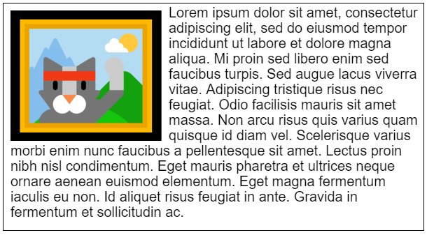

# Formatted Text - Input Data Model

This document describes how to provide input text (and associated formats) that describe multi-line
formatted text in order to have it shaped and formatted into metrics. The input consists of text
(JavaScript strings), along with metadata (e.g., for internationalization) and CSS formats/style.
Formatted text can be created in both document and non-document (Worker) scenarios and has no
dependency on DOM Text nodes or Elements.

This explainer focuses on the input data model for formatted text. The output is described in 
a separate [formatted text metrics](explainer-metrics.md) explainer. The obtained metrics objects
can then be [rendered](explainer-rendering.md) if desired. For the motivating problems and use
cases, see the [readme](README.md).

## Providing an input model for formatted text

On the web today, to render text there are two general options: use the DOM (HTML's 
`CharacterData`/`Text` nodes or SVG Text-related Elements), where text is collected in the
document's "retained" mode infrastructure; the web platform decides when and how to compose and
render the text with declarative input from you (in the form of CSS); alternatively, Canvas can
be used to measure (and render) the text directly with JavaScript (an "immediate" mode approach).
Canvas provides very limited text support today and (by design) leaves any special formatting, text
wrapping, international support, etc., up to the JavaScript author.

Input text and formats are fed into one of two "formatter functions" that produce either a container
of metrics (a `FormattedText` instance) or an iterator that produces line metrics (`FormattedTextLine`
instances). The capabilities of these (and other) metrics objects are described separately in 
[the output text metrics](explainer-metrics.md).

This explainer focuses on the **input** parameters for formatting text.

### Principles

* Don't create yet-another-data-model for holding text (e.g., `Text` nodes)--just use strings!
* Scope formatting to the needs of inline text layout.
* Leverage CSS as the universal text layout system for the web (even in an imperative model) which 
    also provides for future extensibility.
* Avoid multi-level hierarchal text structures (which ultimately must be linearly iterated for 
    rendering anyway)
* Object-centric model (versus range+indexes) avoids common problems with overlapping indexes and
    is a familiar design pattern for authors.
* Provide flexibility for simple use cases (flowing a single paragraph in a container) _and_ 
    advanced use cases (fragmentation, pagination, custom flowing and wrapping such as CSS regions).
* Provide easy-to-use ergonomics for JavaScript authors (iterator protocol)
* Extensibility for internationalization hints and reserved future scenarios.

## Formatting text all at once

Formatted text can be obtained using two formatting functions: `format` and `lines`, both available as
static functions of the `FormattedText` constructor object. The parameters to both functions are 
similar. This section will describe the input data model in terms of the `format` formatting function.
`lines` will be described later on.

`format` produces output [text metrics](explainer-metrics.md) directly in one call. The result of all
the text formatting (and potential line wrapping) is available on a synchronously returned 
`FormattedText` instance, which represents the text metrics for a container (or paragraph) of formatted
text. The input parameters are:

1. text or an array of text
2. metadata/ style for all the text
3. constraints for the formatting process

Each of these is explained in more detail below.

### Expressing text

Text can be expressed as JavaScript strings, or as a JavaScript object with property named
`text` that has a JavaScript string as its value.

```js
// The following representations of text are equivalent:
FormattedText.format( "hello" );
FormattedText.format( { text: "hello" } );
```

Text can also be expressed in separate runs (which are concatenated together when formatted)
when wrapped in an Array. The following are equivalent:

```js
// The following text runs are equivalent:
FormattedText.format( [ "hello", " world!" ] );
FormattedText.format( [ { text: "hello" }, { text: " world!" } ] );
```

### Adding some style

Without additional input, the formatter functions will apply default styles in their operation, based
on the default styles of CSS (such as `font-family`, `font-size`, `color`, `writing-mode` etc.). But
default styles are boring. Here's how to add your own style and formatting to the text.

Style for *all the text* (global styles for the purposes of this function call) are provided via
the second parameter to `format`. Style input uses the same syntax as Element inline styles 
(i.e., `<span style="color:blue;font-family:arial">` semi-colon separated property/value pairs)
and is ultimately parsed with the same CSS parser. The following formatted text outputs will all 
be blue:

```js
FormattedText.format( "hello world!", "color: blue" );
FormattedText.format( [ "hello", " world!" ], "color: blue" );
FormattedText.format( [ { text: "hello" }, { text: " world!" } ], "color: blue" );
```

Like text, style strings can be wrapped in a JavaScript object with property named `style` that 
has the style text string as its value. The following are equivalent:

```js
// The following are equivalent expressions of style:
FormattedText.format( "hello world!", "color: blue" );
FormattedText.format( "hello world!", { style: "color: blue" } );
```

### Styling specific text runs

If specific text runs need to override or have specific style values, then style can also be
added to the object-form of a text run. In this example, the word "brown" will be colored
brown and bold and all the text will be italic:

```js
FormattedText.format( [ "The quick ", 
                        { text: "brown", style: "color: brown; font-weight: bold" },
                        " fox jumps over the lazy dog." 
                      ], "font-style: italic" );
```

And in the following example, all the text will be blue _except_ for the word brown, which
will be colored brown:

```js
FormattedText.format( [ "The quick ", 
                        { text: "brown", style: "color: brown" }, 
                        " fox jumps over the lazy dog."
                      ], { style: "color: blue" } );
```

A wide range of inline layout-related CSS is supported as style input to the formatting functions.

Styles specified in the second parameter apply to all text runs except where the specific style
property is also specified (overridden) on an individual text object (in the first parameter).

### Specifying constraints

The inline-size constraint is the 3rd parameter for both formatting functions. `format` has
an additional 4th parameter for the block-size constraint. Because the `format` function 
produces all the lines of text at once, the block-size constraint (param 4) allows the author to
specify a maximum bound for the container in both directions.

To specify an inline-direction constraint for line wrapping with the `lines` iterator:

```js
// Specify the desired default line wrapping distance (in the inline direction) of 150 pixels for each 
//  line that will be produced by the lines() iterator.
FormattedText.lines( "The quick brown fox jumps over the lazy dog.", null, 150 );
```

For `format`, an additional block-size constraint is provided via a 4th parameter:

```js
// Wrap any text that exceeds 150 pixels, and constrain to 300 pixels in the block direction
FormattedText.format( "The quick brown fox jumps over the lazy dog.", null, 150, 300 );
```

The 3rd (and for `format`) 4th parameters are `unsigned long` values. Omitted values are assumed 
to be infinite.

The layout flow via `writing-mode` and `direction` style properties can only be set in the 2nd
parameter (global styles for all the text) and this value (or the default value) is used to
determine the orientation of the inline and block constraint values<sup>*</sup>. For example, 
when the value is `horizontal-tb` (e.g., Latin-based languages) the 3rd parameter (inline-size
width constraint) is a horizontal constraint for line wrapping; overflow of the block-size
constraint (4th parameter) will occur in the vertical direction. For specified writing-modes such as
`vertical-rl` (e.g., Chinese) the inline-size constraint affects the vertical direction, with overflow
occurring horizontally.

<sub>*HTML will handle `writing-mode` set on _inline_ elements (when the result is an orthogonal 
writing mode direction) by "blockifying" the inline container into an inline-block in order to support the
writing mode. This conversion from inline content to inline block is not supported in the Formatted
Text input model, and thus paragraphs of text with nested orthogonal writing mode directions are not
supported.</sub>

**Note**: [Issue 43: What should constraining the block-progression direction do?](https://github.com/WICG/canvas-formatted-text/issues/43) tracks an unresolved issue about allowing constraints in both directions.

## Formatting Text line by line

As an alternative to `format`, the **`lines`** formatting function will prepare an iterator that progressively
formats the provided input line by line. The lines are returned by the iterator directly, as `FormattedTextLine`
instances, without any container structure (e.g., not contained within a `FormattedText` instance as `format`
produces). Because there is no container structure, web authors are responsible for using the metrics exposed
on each line to manually position them as desired.

```js
// Format the input text as specified, with line-breaks at 350 pixels.
let iter = FormattedText.lines( [ "The quick ", 
                                  { text: "brown", style: "color: brown; font-weight: bold" },
                                  " fox jumps over the lazy dog." 
                                ], "font-style: italic", 350 );
// Use for..of to advance the iterator and get each line.
for ( let line of iter ) {
    // TODO: lookup metrics info on the line instance and/or prepare to render it in a custom location
}
```

### Custom line breaking

In many scenarios, authors may want to customize the inlineSize constraint applied to each line as the iterator 
runs. The iterator returned by `lines` has a read/write property called `inlineSize` which specifies where the
next line's inlineSize break opportunity should be. It's default value is the value provided in the `lines` 
function (parameter 3). The `inlineSize` property can be set to change the value used by the iterator. If the
`inlineSize` value is changed, the change is "sticky" and will persist for subsequent lines until changed again.

For example, if there is some external shape that text needs to wrap around, the lines iterator can be adjusted 
at the appropriate times to shorten or lengthen the `inlineSize` constraint so that the lines can be positioned
properly (line positioning must be done manually).



```js
// Caller provides text to format, a CSS font string, width/height constraints,
//  a box location/dimensions, and a rendering function callback 
//  that accepts a `FormattedTextLine` (result from the lines iterator).
function wrapAroundFloatLeftBox( text, cssFont, constraints, box = { width: 200, height: 200, marginRightBottom: 10 }, renderFunc ) {

  // Prepare the input text and get a line iterator
  //  (Set the default inlineSize for line-wrapping to the known constrained space.)
  let formattedTextIterator = FormattedText.lines( text, cssFont, constraints.width - box.marginRightBottom - box.width );
  
  // sum of line metrics (collected from line instances)
  let lineHeightTotal = 0;
  // horizontal position offset for line placement (starts offset)
  let offsetX = box.marginRightBottom + box.width;
  
  // Start iterating lines...
  for ( let line of formattedTextIterator ) {
    
    // Render the line at the current offsets
    renderFunc( line, offsetX, lineHeightTotal );
    
    // Prepare for the next line (using line metrics)
    lineHeightTotal += line.height;
        
    // Determine if the offsetX position needs to change
    if ( lineHeightTotal > ( box.marginRightBottom + box.height ) ) {
      offsetX = 0;
      formattedTextIterator.inlineSize = constraints.width; // Change the iterator's line-break position for subsequent lines...
    }   
  }
}
```

*Note*, the iterator's [Symbol.iterator] function (used by the iterator protocol in for..of loops) 
is a self-reference to the same iterator object, allowing convenient use inside of for..of loops.

### Rewinding line iteration

In some scenarios (for example, an algorithm for a balanced multi-column line layout, shown later), 
it is sometimes necessary to "roll-back" and reprocess a line that was previously produced by the 
iterator to adjust its line-break constraints.

⚠️**Issue**: traditional JS iterator protocol does not expect rewinding behavior. This needs careful 
review and consideration for any unexpected language side-effects.

The `lines` iterator keeps track of the number of lines that it has produced so far via the `lineCount` 
readonly property. In the event that the web author needs to revisit a prior line, the iterator can be
`reset` back to a line `<=` the current iterator's `lineCount` value. Any line instances that were
previously provided via the iterator following the line that the iterator is reset to are "discarded"
(no longer usable). The `reset` function takes a singe integer parameter. If the number is zero or 
positive, the iterator is reset to the specified line index.

```js
formattedTextIterator.reset(0); // Rewinds the iterator to before the first line (the beginning)

formattedTextIterator.reset(1); // Rewinds the iterator to just after the first line (start of the second line)
```
A negative value resets the iterator to a relative number of lines from the current `lineCount` value.

```js
// Assuming formattedTextIterator.lineCount == 1
formattedTextIterator.reset(-1); // Rewinds the iterator by 1 line to the beginning (line 0). lineCount will be 0.

// Assuming formattedTextIterator.lineCount == 5
formattedTextIterator.reset(-2); // Rewinds the iterator by 2 lines to the end of line 3 (start of line 4). lineCount will be 3
```

The following example implements a naïve multi-column line balancer, where the text lines should be
(approximately) balanced between columns of differing widths.

```js
// Text line positioner for two non-uniform columns
// (assumes infinite block-size for each column)
// (assumes uniform formatting for all the text)
function multiColumnFiller( text, col1Box, col2Box, renderFunc ) {
  let col1_inlineSize = col1Box.width;
  let col2_inlineSize = col2Box.width;
  
  // What is the ratio of the first column's width compared to the total width?
  let ratio = col1_inlineSize / ( col1_inlineSize + col2_inlineSize );
  // Naïvely then, 'ratio' of the total number of lines that will fit in col1 
  // will stay in col1, the rest will be balanced to col2.
  
  // How many lines fit in col1 given its size?
  let lineIter = FormattedText.lines( text, null, col1_inlineSize );
  let col1Lines = [];
  for ( let line of lineIter ) {  // process all the lines and return them in an array
    col1Lines.push( line );
  }
  
  // Rough-out the line at which to move the rest to column 2
  let cutLineIndex = Math.floor( ratio * lineIter.lineCount );
  // Discard the lines (inclusive) after this cut line from column 1's lines.
  col1Lines.splice( cutLineIndex );
  
  // Reset the iterator to the cut-line index, adjust the iterator's inlineSize 
  // constraint and get the rest of the lines
  lineIter.reset( cutLineIndex );
  lineIter.inlineSize = col2_inlineSize;
  let col2Lines = [];
  for ( let line of lineIter ) {
    col2Lines.push( line );
  }
  
  // Assign positions for each of the lines in both columns and render (left-justified)
  // First column location
  let xPos = col1Box.x;
  let yPos = col1Box.y;
  for ( let line of col1Lines ) {
    renderFunc( line, xPos, yPos );
    yPos += line.height;
  }
  // Second column location
  xPos = col2Box.x;
  yPos = col2Box.y;
  for ( let line of col2Lines ) {
    renderFunc( line, xPos, yPos );
    yPos += line.height;
  }
}
```

## Comparison to HTML

The formatting functions are used to drive the web platform's layout engine, therefore, the output of
`format` and `lines` should be the equivalent to what can be already performed in HTML using simple 
elements like `div` and `span`. The following two expressions are functionally equivalent, with the
exception that the result of `format` has not been rendered (how to
[render it is described separately](explainer-rendering.md)):

```js
FormattedText.format( [ "The quick ",
                        { text: "brown", style: "color: brown; font-weight: bold" },
                        " fox jumps over the lazy dog"
                      ], null, 150, 100 );
```

```html
<div style="width:150px;height:100px">
  <span id="meta_object">
    <span>The quick </span>
    <span style="color: brown; font-weight: bold">brown</span>
    <span> fox jumps over the lazy dog</span>
  </span>
</div>
```

Above, the `<div>` element is the container for an inline formatting context which sets the 
available width and height in which to layout the content, and the `<span id="meta_object">` gets
any meta object styling (in this case, nothing), and contains the formatting for the text runs.
The text run styles on the word "brown" are applied to its immediate containing span.

Another illustrative comparison shows how style on the meta object provided to `format` could be
visualized:

```js
FormattedText.format( [ "The quick ", 
                        { text: "brown", style: "color: brown" }, 
                        " fox jumps over the lazy dog."
                      ], { style: "color: blue" } );
```

```html
<div>
  <span id="meta_object" style="color: blue">
    <span>The quick </span>
    <span style="color: brown">brown</span>
    <span> fox jumps over the lazy dog</span>
  </span>
</div>
```

## CSS to achieve advanced scenarios

### Vertical Text

By leveraging existing CSS styles for writing modes and other related properties,  
`format` can support a variety of vertical text scenarios. For example, by simply
leveraging the `writing-mode` property we can orient text in its traditional vertical
direction:

```js
let bold = "font-weight: bold";
let meta = "writing-mode: vertical-rl; font-size: 36pt";
FormattedText.format( [ "不怕慢，", { text: "就怕站", style: bold } ], meta, 200 );
```

[When rendered](explainer-rendering.md), and constrained as indicated, this will render as:


In combination with other related CSS properties, many other vertical text layouts are
possible:

```js
let bold = "font-weight:bold";
let styles = `writing-mode: vertical-lr;
              text-orientation: upright;
              line-height: 2;
              text-align: center;
              font-size: 12pt`;
FormattedText.format( [ "It's better to make slow progress", 
                        { text: " than no progress at all", style: bold }
                      ], styles, 250 );
```

This might render as:


### Reusing styles (`FormattedTextStyle`)

When style text strings are passed to the `format` function, they must be parsed into
CSS properties (including verifying valid syntax). This process is usually fast but not
free. It is likely that when preparing to format many text strings, or when repeatedly 
calling `format` in performance critical code paths, there are opportunities to re-use 
sets of CSS styles as a unit.

A new write-once object is introduced to collect and cache these styles. It makes use
of a [StylePropertyMapReadOnly](https://drafts.css-houdini.org/css-typed-om/#stylepropertymapreadonly)
to reflect the parsed values for read-only inspection following construction:

```js
// Save the upright text styles from the previous example for later re-use
let styles = new FormattedTextStyle( `writing-mode: vertical-lr;
                                      text-orientation: upright;
                                      line-height: 2;
                                      text-align: center` );
styles.styleMap.has( "text-orientation" ); // returns true
styles.styleMap.size; // returns 4, the number of declarations in the map
for ( let [prop, val] of styles ) { // Enumerate everything in the map
   console.log( `${prop}: ${val}` );
}
```

The `FormattedTextStyle` object can be used in all the places in the data model that
accept a style text string. For example the following are equivalent:

```js
let bold = "font-weight: bold";
let vertical = "writing-mode: vertical-rl";
FormattedText.format( [ "不怕慢，", { text: "就怕站", style: bold } ], vertical );

let reusableBold = new FormattedTextStyle( "font-weight: bold" );
let reusableVertical = new FormattedTextStyle( "writing-mode: vertical-rl" );
FormattedText.format( [ "不怕慢，", { text: "就怕站", style: reusableBold } ], reusableVertical );
```

### How much CSS should be supported?

The `format` and `lines` functions supports various CSS properties that influence how the
text's lines will ultimately be positioned. There are also many CSS properties that do not 
apply to text, that convert between typical text layout and other layouts, or that take 
normal flow content out of flow (e.g., `float`, `position`, `display`, etc.). For the purposes
of a formatted text object model, not all CSS properties can or should be supported. The
guidelines for what CSS to support and what not to support follow.

### Focus on text-related CSS properties

We believe it makes sense to only support CSS properties that provide specific features
for inline-level content (text) and the management of the text's container (the metadata
parameter). Other properties, especially those that would change the layout characteristics 
of text objects from their assumed inline-level nature, will not be supported. In the data
model we keep the semantics of text runs consistent with the CSS that can be applied.

Applying the above principle means that `float` would not
be supported because it has the effect of changing the object's computed display value 
from inline to block (taking it out-of-flow). `position: absolute` as a metadata property also takes
the object out of the normal flow. Likewise, the `width` and `height` properties on specific text runs would
be ignored because they do not apply to inline-level elements. Attempting to set these 
properties would have no effect. On the other hand, `padding` **would be supported** and 
applied to text runs in accordance with the rules of CSS inline layout,
e.g., the inline-direction `padding` values are taken into account while the 
block-direction values are not.

The container for text runs is an independent containing block. It is essentially a 
`display: flow-root` object that establishes an inline formatting context for its children.
When used in the metadata parameter, properties like `top`, `right`, `bottom`, and `left` do
not apply (i.e., the text run container acts as its own initial containing block). Positioning
the resulting formatted text for the purpose of rendering in some context must be done separately.

In some cases, we imagine it will be useful to allow `format` metadata properties to support 
some limited alternate layout container types where those alternate types provide unique text layout
capabilities. For example, we expect to support an inner display type of `ruby` in order to 
become a Ruby container and enable the use of Ruby annotated layout. Other container types are
not currently planned to initially support 
but are interesting long-term candidates to consider (e.g., multi-column containers created via 
the `columns` shorthand property), while still others are less-likely to be supported (e.g., `flex`
and `grid` container types, which are less useful for formatted text scenarios).

There are various CSS properties that provide helpful graphical emphasis to text that are 
also supported. These are for convenience in supporting common text formatting scenarios
that would otherwise require detailed introspection of the object model's related metrics
in order to correctly layout and render as desired with respect to the text. Because these
features are already available in CSS layout engines and significantly ease author burden, 
many of these CSS properties will be supported. Some supported examples include: 
`text-decoration`, `text-shadow`, `box-shadow`, even `border`, `outline`, and limited 
`background` support (where the metrics and composition processing do not require external
dependencies, such as image resources typically loaded by `url()` functions).

### Future extensions 

By leveraging CSS, we get the added benefit of a well-known constraint language for 
expressing box bounds and the expected behavior for content (in our case formatted text 
content) that overflows those bounds. `width` and `height` and corresponding `min-width`
or `max-height` properties express the desired constraints for eventual line-box 
computation when it comes to rendering the object model or returning metrics. Similarly,
`overflow` and `clip-path` can further ensure the text content expands or is clipped to
fit the desired constraints. These properties would only apply in the metadata parameter
of `format`.

CSS continues to evolve, and it makes sense to extend relevant new CSS properties to
this object model as they become a part of the web platform. For example, while not
widely supported at the time of writing, support for `shape-inside` (CSS Shapes L2)
and CSS Exclusions provide exciting growth opportunities for text using this model.

## Internationalization

CSS provides various existing properties for handling internationalization of text, such
as `writing-mode`, `direction`, `unicode-bidi`, and others. However, it does not have a
property for expressing language (CSS Selectors provide `:lang(xx)` but this is not a 
property).

Therefore, all text objects (and metadata objects) will support an optional `lang` property
whose value will accept the set of supported values of the equivalent HTML `lang` attribute
(or XML/XHTML `xml:lang` attribute).

An example where the `lang` property is used to provide clarify on the text object directly:

```js
FormattedText.format( { text: "不怕慢就怕站", lang: "zh-Hans" } ); 
```

Or it can be applied to the metadata object (generally the preferred option unless there
are multiple text runs of differing language):

```js
FormattedText.format( [ "不怕慢", "就怕站" ], { lang: "zh-Hans", style: "color: red" } );
```

### Bidi Text

No additional work is needed from web developers to support bidi text. At `format` time,  bidi
analysis is done on the input text which creates internal bidi runs if necessary. For example:

```js
FormattedText.format( "Sample arabic بمدينة مَايِنْتْس، ألمانيا text.", "font: 30px Arial", { width: 350 } );
```

Might produce the following rendered output:


## WebIDL

```webidl
[Exposed=Window,Worker] 
interface FormattedText { 
  static FormattedText format( ( DOMString or FormattedTextRun or sequence<( DOMString or FormattedTextRun )> ) text,
                               optional ( DOMString or FormattedTextStyle or FormattedTextMetadata ) metadata,
                               optional double inlineSize, optional double blockSize );
  static FormattedTextIterator lines( ( DOMString or FormattedTextRun or sequence<( DOMString or FormattedTextRun )> ) text,
                                      optional ( DOMString or FormattedTextStyle or FormattedTextMetadata ) metadata,
                                      optional double inlineSize );
};

[Exposed=Window,Worker] 
interface FormattedTextStyle {
  constructor( ( DOMString or StylePropertyMapReadOnly or CSSStyleDeclaration ) styleText );
  [SameObject] readonly attribute StylePropertyMapReadOnly styleMap;
};

dictionary FormattedTextMetadata { 
  ( DOMString or FormattedTextStyle) style;
  DOMString lang;
}; 

dictionary FormattedTextRun : FormattedTextMetadata { 
  DOMString text = "";
}; 

interface FormattedTextIterator {
  readonly attribute unsigned long lineCount;
  FormattedTextIterator [Symbol.iterator](); // returns self
  FormattedTextIteratorProtocolResult next();
  attribute double inlineSize;
  void reset( long lineIndex );
};

dictionary FormattedTextIteratorProtocolResult {
  FormattedTextLine? value;
  boolean done;
};
```

## Supported CSS Table

We've compiled a list of text-related (or generally applicable) CSS properties that we believe make
sense to support on metadata and text objects. This list is not exhaustive.
For example, it does not include many of the new logical properites such as `inline-size` for 
`width`. This list is provided for potential testing purposes and to facilitate discussion.

| CSS Property | metadata object | text object | inherits | Notes |
|--------------|---------------|------------------|----------|-------|
| background | ✔ | ✔ | no | background-attachment, background-origin, background-position, background-repeat, background-size operate on an external resource image and will be ignored. Background-image will only support `<gradient>` functions |
| border | ✔ | ✔ | no |  |
| border-image | ✔ | ✔ | no | border-image-source will only supports `<gradient>` functions |
| border-radius | ✔ | ✔ | no |  |
| box-decoration-break | ✔ | ✔ | no |  |
| box-shadow | ✔ | ✔ | no |  |
| box-sizing | ✔ |  | no |  |
| clip-path | ✔ | ✔ | no |  |
| color | ✔ | ✔ | yes |  |
| direction | ✔ | ✔ | yes |  |
| display | ✔ | ✔ | no | Generally not supported, but may make exceptions, e.g., ruby |
| font | ✔ | ✔ | yes |  |
| font-feature-settings | ✔ | ✔ | yes |  |
| font-kerning | ✔ | ✔ | yes |  |
| font-size-adjust | ✔ | ✔ | yes |  |
| height | ❌ | ❌ | no |  |
| hyphens | ✔ | ✔ | yes |  |
| letter-spacing | ✔ | ✔ | yes |  |
| line-break | ✔ | ✔ | yes |  |
| line-height | ✔ | ✔ | yes |  |
| margin | ✔ | ✔ | no |  |
| mask | ✔ | ✔ | no | mask-border-source will only supports `<gradient>` functions |
| mask-border | ✔ | ✔ | no |  |
| max-height | ❌ | ❌ | no |  |
| max-width | ❌ | ❌ | no |  |
| min-height | ❌ | ❌ | no |  |
| min-width | ❌ | ❌ | no |  |
| opacity | ✔ | ✔ | no |  |
| outline | ✔ | ✔ | no |  |
| overflow-wrap | ✔ | ✔ | yes |  |
| padding | ✔ | ✔ | no |  |
| tab-size | ✔ | ✔ | yes |  |
| text-align | ✔ |  | yes |  |
| text-align-all | ✔ |  | yes |  |
| text-align-last | ✔ |  | yes |  |
| text-combine-upright | ✔ | ✔ | yes |  |
| text-decoration | ✔ | ✔ | no | |
| text-emphasis | ✔ | ✔ | yes | |
| text-indent | ✔ |  | yes |  |
| text-justify | ✔ | ✔ | yes |  |
| text-orientation | ✔ | ✔ | yes |  |
| text-overflow | ✔ |  | no |  |
| text-shadow | ✔ | ✔ | yes |  |
| text-transform | ✔ | ✔ | yes |  |
| text-underline-offset | ✔ | ✔ | yes |  |
| text-underline-position | ✔ | ✔ | yes |  |
| transform | ✔ |  | no |  |
| transform-box | ✔ |  | no |  |
| transform-origin | ✔ |  | no |  |
| unicode-bidi | ✔ | ✔ | no |  |
| white-space | ✔ | ✔ | yes |  |
| width | ❌ | ❌ | no |  |
| word-break | ✔ | ✔ | yes |  |
| word-spacing | ✔ | ✔ | yes |  |
| word-wrap | ✔ | ✔ | yes |  |
| writing-mode | ✔ | ❌ | yes |  |

### Limitations

* **CSS pseudo-elements** (`::first-letter`, `::first-line`, `::before`, `::after`). Pseudo-elements
   would require some unique way to specify the style map for these. A workaround for `::first-letter` 
   is relatively easy (separating it into a separate text runs, or implementing support for
   the related property `initial-letter`), but `::first-line` is harder to target given it depends on 
   where the line breaks.
*  explicit values of `inherit` on CSS properties that aren't specified to inherit by default will not
   likely be supported.

## Accessibility Considerations

While the input to the `format` or `lines` functions is not expected to be accessible (it's the web
author's internal data model), the resulting text metrics output will be useful in providing the means 
to enable fully accessible scenarios. This will be described in greater detail in the text metrics
explainer.

## The output of `format`
The [next explainer](explainer-metrics.md) describes the output from the `format` and `lines` functions,
e.g., the `FormattedText` and `FormattedTextLine` instance objects and related info.

## Contributors:
 [dlibby-](https://github.com/dlibby-),
 [ijprest](https://github.com/ijprest),
 [sushraja-msft](https://github.com/sushraja-msft),
 [travisleithead](https://github.com/travisleithead)
