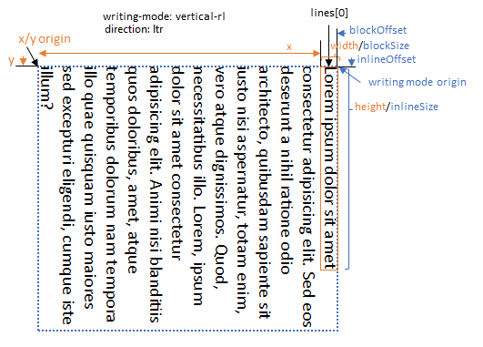

# Formatted Text - Metrics

A representation of formatted text metrics for inline layout content: the result of the `format`
function or [potentially] other APIs that extract formatted text metrics from other sources
(e.g., DOM nodes, Layout Worklets).

Additional scenarios include different web application rendering systems which can make use of
the text shaping information to perform their own rendering logic. For example WebGL based apps
with text content. The metrics would be used to determine how to correctly position glyphs in a
typographically correct manner.

We took extensive inspiration from the [Text API explainer](https://github.com/google/skia/blob/main/site/docs/dev/design/text_overview.md),
and the use cases supporting the rendering of glyphs as described therein, as well as the
notion of a Position object.

For a general overview of the feature, see the repo's [readme](README.md).
You can also learn more about the [formatted text data model](explainer-datamodel.md) and
[how to render it](explainer-rendering.md).

# Use cases

## 1. Use case: text placement

This use case is the most basic use case we can imagine--identifying the placement of some
Formatted Text into a view layer (like Canvas). Placement needs two things, a reference
coordinate (x/y) and size metrics (bounding box of width/height).

* Metrics provide the final shaped and formatted text width and height.

Authors ensure rendered text will fit in
   the space provided by their data model. If not, they can adjust font-size, line-width,
   line-spacing, etc., on the input text objects and re-`format` until
   the desired goal is met.

## 2. Use Case: line placement and custom per-line lengths

In this case, the author would like to specify per-line constraints and intends to render
each line iteratively (such as for captions), or with custom spacing such as to fit into a
unique layout or flow (or handle inline gaps such as for figures that flow with the text.

Metrics provide:
* Access to formatted line objects with width and height
* Pointers back to the input characters for the bounds positions of each line.

## 3. Use Case: specific glyph placement

**Note**: this use case may be dropped.

⚠🚧 We would like to validate this use case for Canvas 2D scenarios. For WebGL scenarios, we
understand the key information needed for rendering is the given shaped font's glyph id and
glyph advance information. Is a Canvas 2d rendering API needed? A sketch of how this might
work follows.

Metrics provide:
* List of shaped glyph metrics per fragment (fragment is a unit of glyphs that all share the
   same format/font/bidi/etc.).
* Pointers back to the input characters for each glyph's bounds.

Authors would use the `FormattedTextFragment` (holder of glyph's shaped information),
   and glyph info (index within that fragment or ID within the font) to render it.

## 4. Use Case: Editing: Rendering a selection over text (and placing/moving a caret)

Many of the scenarios behind the chosen metrics are based on common editing use cases. An editing
surface must provide a visual view and the means to move insertion points, selection ranges, etc.,
by responding to various input including pointing devices and keyboard. In order to support these
input modalities, the metrics supplied by the explainer chiefly provide the means of understanding
the relationships between parts of text as it was laid out (the glyphs that make up segments of
like-formatted runs called "fragments" in this proposal, lines, etc.) and the relatiionship between
these metrics and their source text objects.

Metrics provide:

* Position objects that map line/fragment/glyph indexes to input data model runs/offsets.
   (Map from text metrics to data model.)
* API for obtaining position objects given input data model runs/offsets. (Map from
   data model to text metrics.)
* API for obtaining position objects given (x,y) offsets relative to the `FormattedText`.
   (Map for mouse/touch/pen input to text metrics and data model.)
* Access to formatted line objects with width/height (bounding box) and offsets from their
   container.
* Access to formatted fragments within lines with width/height (bounding box) and offset from
   their container (if a selection needs to be tightly bound around the formatted glyph runs
   inside of lines).
* Access to glyph width/height (bounding box) and offset from the fragment container.

# Overview: data model to metrics to rendering

The `FormattedText` constructor's static method `format` (described in the 
[data model](explainer-datamodel.md)) returns an instance of a `FormattedText` object, which
internally holds all of the formatted text ready for rendering and is also the root object of
the metrics describe in this explainer.

The `FormattedText` object retains the formatted structure of the input text, and offers APIs to
query the total bounding box of the text as constrained at any given moment; APIs to adjust the 
constraints for a given line and its descendents resulting in text that wraps at different 
specified lengths, and other APIs for serving common use cases for which an understanding of the
formatted text and its relationship to the input text is important (e.g., editing cases).

This object **is updated** as contraints on the lines are changed. Updates and changes may include
number of lines of text (line break locations), per-line sizes, bounding box values, and related
mapping back to input text for subsequent fragments. Updates will **not** include changes to the 
underlying text or style. In order to mutate the text, `format` must be called again with 
different input (which will return a new object; a different instance of a `FormattedText` object).

The `FormattedText` is a container for all the input data model's metrics. It contains the APIs
to get additional lines, fragments, and glyph information. The object hierarchy is shown below (note
the image shows lines in a horizontal writing mode--but vertical writing modes are supported):

The `FormattedText` and `FormattedTextLine` objects may be rendered independently. We propose APIs
to render them in the [Rendering explainer](explainer-rendering.md).

## Thinking ahead: future integration into DOM or Houdini Layout API

⚠🚧 WARNING: This section is entirely speculative, and out of scope for now. We include it here
to ponder extended use cases in which these metrics could be applicable in the wider web platform.
(And not to lose track of them in the design process.)

The opportunity to get detailed metrics for formatted text is not exclusively tied to scenarios
where DOM is potentially unavailable or impractical to use. We would like to ensure that we design
for the possibility of integration into both DOM and Layout API scenarios as well.

We envision APIs similar to `format`, that could also extract formatted text metrics but for 
Elements. In the DOM, a given `Node` already has a layout (when attached to the tree) that includes
a Layout box model and is already constrained by the viewport and the hierarchy of nested layouts in
which it resides. A new API something like `getFormattedText()` would return the formatted
text metrics for an Element (acting like the `innerText` or `textContent` getters, but with context
of the line formatting, relative placement of the lines and other metrics). Another approach might be
extending a related API such as [`getClientRects()`](https://drafts.csswg.org/cssom-view/#dom-element-getclientrects)
with line metric information.

In the [Houdini Layout API](https://drafts.css-houdini.org/css-layout-api-1/), while processing a 
`layout`, `LayoutFragment` objects can represent a line of text (or a fragment from a line).
In these situations, it might make sense to extend the `LayoutFragment` by combining it with a
`FormattedTextLine` metrics object. This would provide extra information about the intra-line fragments
and glyph information, potentially allowing advanced positioning of glyphs within a line-layout pass.

| ⚠🚧 Ideas for integration into other parts of the platform | Description |
|---|---|
| myElement.`getFormattedText`() | Similar to `format`. TBD on scope of how this would work 😊 |
| `extDOMRect`.`textFragments`[`i`] | Alternative DOM integration point that extends `getClientRects()` such that each rectangle gets the `FormattedTextLine` mixin or some such. |
| `extLayoutFrag`.`textFragments`[`i`] | Array of `FormattedTextFragments` (see equivalent functionality in a `FormattedTextLine` object). |

# Description of objects

## Root metrics container - `FormattedText`

This is the top-level container returned by `format`. It provides:

* width/height (total bounding box for all lines).
* array of `FormattedTextLine` objects.
* a coordinate system for its lines (see section below).
* Input-to-output mapping APIs
    * Getting a position for a given character/text run of the input text (position
       objects described below).
* Pointer-to-output mapping APIs (hit testing)
    * Getting a position from an x/y coordinate pair (where the x/y coordinates
       are relative to the `FormattedText` object's coordinate system.
* Reformatting APIs
    * Adjusting the current "flow" of the text by providing updated width/height
       constraints for a given line and its following lines.

| APIs on `FormattedText` | Description |
|---|---|
| .`width` | Returns the bounding-box width for all lines (adjusted as lines are re-constrained). For vertical writing modes, the value may exceed the provided width constraint if additional lines wrap beyond the provided width (the block direction for vertical writing modes). |
| .`height` | Returns the bounding-box height for all lines (adjusted as lines are re-constrained). For horizontal writing modes, the value may exceed the provided height constraint if additional lines wrap beyond the provided height (the block direction for horizontal writing modes). |
| .`lines`[] | An array of `FormattedTextLine` objects representing distinct lines of text in the inline flow.* |
| .`getPosition`(`textIndex`, `charIndex`) | Given a reference to an in input character (and the text object offset; 0 if only one string of text provided), returns a `FormattedTextPosition` of the associated place in the output metrics. |
| .`getPositionFromPoint`(`x`,`y`,`findNearest`) | For mapping pointer positions into glyphs. `findNearest` might ensure that a `FormattedTextPosition` is always returned regardless of the coordinate value, whereas otherwise, `null` might be returned if not strictly over a glyph. |

*In most cases, e.g., all cases where `FormattedText` instances are returned from the
`format` command, each `FormattedTextLine` object in the array will correspond to a separate visual
line for rendering. However, in cases where a `FormattedText` instance is created from a DOM node,
it is possible that multiple `FormattedTextLine` objects may be visually located on the same line
when they are broken by non-inline content (such as figures, tables, etc., that are of 
`display: inline-block` layout). In this latter case, the positions and offsets of each 
`FormattedTextLine` will identify these situations.

### Coordinate systems

Some APIs on the `FormattedText` object depend on coordinate systems for hit-testing, such as the
`getPositionFromPoint` API, which takes an x/y pair. To simplify the logic for developers when
translating between input pointer coordinates in viewport space and the coordinate space used by 
`FormattedText` objects, each `FormattedText` object has a *pointer origin* or *pointer coordinate
space* with its origin in the typical upper-left corner of the bounding box rectangle that contains
all the lines of text. For pointer tracking, all `x`/`y`/`width`/`height` values for the 
`FormattedTextLine`, etc. objects are absolute values relative to the origin of 
the pointer-origin coordinate space.

The pointer-origin coordinate space is not the most developer friendly for computing line offsets 
and positions in other writing modes. For that reason, `FormattedTextLine`, `FormattedTextFragment`,
etc., objects also have a *writing mode origin* or *writing mode coordinate space* which is the 
origin of the block and inline progression directions for the chosen writing mode.
`inlineSize`/`blockSize`/`inlineOffset`/`blockOffset` values are each relative to the writing mode
origin for the set of lines formatted using that writing mode.

For example, in a series of lines formatted with `writing-mode: vertical-rl` and `direction: ltr`, the
first line is on the right side of the pointer coordiante space, vertically oriented. The first 
line's origin in pointer coordinate space is the upper-left corner of the line's bounding box at
position (`x`, `y`). The first line's origin in writing mode coordinate space is the upper-right
corner of the line's bounding box, and being the first line, its (`inlineOffset`,`blockOffset`) is 
(0, 0). The line's `blockSize` (i.e., line height) corresponds with the `width` value in the 
pointer coordinate space, while its `inlineSize` (i.e., line length) corresponds with the `height` 
value in pointer coordinate space.

## Positions – `FormattedTextPosition`

Inspired by the
[TextPosition](https://github.com/google/skia/blob/main/site/docs/dev/design/text_shaper.md#access-the-results-of-shaping-and-formatting)
design, a `FormattedTextPosition` object provides the mapping between the formatted snapshot of the data
model (e.g., the root, lines, fragments and glyphs) and the data model itself, which contains the
source characters (Unicode code points) and their CSS-styled text runs. Positions always connect glyphs
with characters and contain all necessary indexes to navigate the object structures to get between glyphs
and characters. Like the rest of the formatted objects, positions are snapshots, and not updated as the
model changes. (So don't change the model until you're done using a `FormattedTextPosition`!)

To find the relevant character(s) in the data model, positions have:

* Text index which text object is being referenced (index of zero when only one text object was specified in `format`)
* Character offset (start and end) since some glyphs are formed from a sequence of characters
   (Unicode combining characters, ligatures, etc., which vary by Font).

To find the relevant glyph in the metrics objects, positions have:
* Line index (within the `FormattedText`)
* Fragment index (within the line)
* Glyph index (within the fragment)

There are some interesting cases to explore when it comes to Glyph mapping from source characters.
These are covered below in the fragments section.

| APIs on `FormattedTextPosition` | Description |
|---|---|
| .`sourceIndex` | An index of the input text object or string that contains the relevant character(s). The term `source` is generic in order to potentially support `Text` nodes as well in the future. **Note**: will need to resolve what the index means for DOM trees with hierarchies. |
| .`characterOffsetStart` | The offset (unsigned long) within `source` that the associated glyph derives from (the start of the range if more than one character). |
| .`characterOffsetEnd` | See above. If only one character maps to a single glyph, the start and end offsets will be the same. |
| .`lineIndex` | The index into the `FormattedText`'s `lines` array where the associated glyph can be found. |
| .`fragmentIndex` | The index into the `FormattedTextLine`'s `textFragments` array where the associated glyph can be found. |
| .`glyphIndex` | The index into the `FormattedTextFragment`'s `glyphs` array where the associated glyph can be found. |

## Lines – `FormattedTextLine`

The line is the bounding box of all the formatted fragments contained within the line (it has no
formatting itself). All fragments contained within the line are wholly contained within (no fragments
exist simultaneously in multiple lines). Note: due to justification or other inline alignment properties
of the line, the line sizes and offsets may vary. The line's offsets are relative to the origin of its
parent `FormattedText` object.

The line provides:

* coordinate positions: x, y, inlineOffset, blockOffset
* bounding boxes: width, height, inlineSize, blockSize
* array of `FormattedTextFragment` objects.
* ⚠🚧TODO: add dominant baseline information?
* Utility functions for getting the start position and end position of the characters that bookend
   the line (e.g., the ability to identify where the line starts and ends in the data model)

| APIs on `FormattedTextLine` | Description |
|---|---|
| .`width` | The line's width in pointer coordinate space (upper-left corner of the `FormattedText` object's bounding box containing all lines). This value may represent the line's width or height depending on the `writing-mode` and `direction` used to format the line. |
| .`height` | The line's height in pointer coordinate space. This value may represent the line's width or height depending on the `writing-mode` and `direction` used to format the line. |
| .`x` | The line's x-offset in pointer coordinate space. |
| .`y` | The line's y-offset in pointer coordinate space. |
| .`inlineSize` | The line's length in the inline direction (i.e., the direction of adjacent characters in the line of text). This value will always be the line's "width" regardless of  `writing-mode` and `direction`. |
| .`blockSize` | The line's height in the block direction (opposite of inline direction). This value will always be the line's "height" regardless of  `writing-mode` and `direction`. |
| .`inlineOffset` | Returns the inline-direction offset from the line's writing mode origin. |
| .`blockOffset` | Returns the block-direction offset from the line's writing mode origin. |
| .`textFragments`[] | An array of `FormattedTextFragment` objects. |
| .`getStartPosition`() | Returns a `FormattedTextPosition` of the glyph forming the "start" end of the line (left side for horizontal LTR). |
| .`getEndPosition`() | Returns a `FormattedTextPosition` of the glyph forming the "end" of the line (right side for horizontal LTR). |

## Fragments – `FormattedTextFragment`

The fragment is the smallest unit of same-formatted text in a line. Fragments always have consistent
directionality (they are post-BIDI algorithm processed, where alternating bidi sequences are split
into separate fragments). All glyphs within have the same font shaping properties applied. Because
of these properties, the fragment metrics are quite similar to the information exposed through
[`measureText()`](https://html.spec.whatwg.org/multipage/canvas.html#dom-context-2d-measuretext).
Consequently, the `FormattedTextFragment` extends the
[`TextMetrics`](https://html.spec.whatwg.org/multipage/canvas.html#textmetrics) interface.

The fragment also holds all the glyph information. The glyph information is to be understood in the
context of the fragment's format (its font metrics).

Note: the `FormattedTextFragment` and future
[Font Metrics API](https://drafts.css-houdini.org/font-metrics-api/#fontmetrics) could be combined,
though in this context the fragment is guaranteed to have consistent font metrics, so things like
the FontMetrics' `fonts` (a list) wouldn't apply.

A Fragment object provides:
* coordinate positions: x, y, inlineOffset, blockOffset
* bounding boxes: width, height, inlineSize, blockSize
* Everything on HTML's
   [`TextMetrics`](https://html.spec.whatwg.org/multipage/canvas.html#textmetrics) interface
* ⚠🚧 Formatting result values (for font, etc.). Note: we would like to understand the use cases
   for some of these better.
* Array of glyph information
* ⚠🚧 Potentially add baseline information (relative to the line) depending on use case?
* Utility functions for getting the start position and end position of the characters that bookend
   the fragment (e.g., the ability to identify where the fragment starts and ends in the data model).
* Utility function for getting a position for an arbitrary glyph in the fragment

| APIs on `FormattedTextFragment` | Description |
|---|---|
| .`x`, `y`, `inlineOffset`, and `blockOffset` | Same as `FormattedTextLine` definition, but with offsets referring to this fragment. |
| .`inlineSize`, `blockSize`, `width`, and `height` | Same as `FormattedTextLine` definition, but with sizes referring to this fragment. |
| .`glyphs`[] | An array of dictionary objects containing glyph info (see next section). |
| .`getStartPosition`() | Returns a `FormattedTextPosition` of the glyph forming the "start" end of the fragment (direction-dependent). |
| .`getEndPosition`() | Returns a `FormattedTextPosition` of the glyph forming the "end" of the fragment (right side for horizontal LTR). |
| .`getGlyphPosition`(`index`) | Returns a `FormattedTextPosition` for the glyph at the given index (in the glyphs array). |
| APIs from [`TextMetrics`](https://html.spec.whatwg.org/multipage/canvas.html#textmetrics) | `width` (total advance width for the fragment; duplicate of `inlineSize` for horizontal writing modes), `actualBoundingBoxLeft`, `fontBoundingBoxAscent`, etc. |
| Formatting result information (fragment specific) | ⚠🚧 To discuss use cases for this data (and how to protect it for installed fonts `fontFamily`, `fontSize`, `direction`, `writingMode`). |

### Fun with source characters and glyph mappings

To form glyphs, font files have processing rules that are font-specific that determine how
characters are mapped to particular glyphs. The presentation of a glyph may be processed differently
depending on the font. For base ASCII characters the mapping is typically trivial--one character is
associated with one glyph. However, for combining characters (and similar), font behavior may vary.
For example, a font may map `á` (U+00E1 Latin Small Letter A with Acute) to a single glyph geometry
(statically or through a processing table). Another font might cause two glyphs (the decomposition of
the glyph `á` into `a` U+0061 Latin Small Letter A and `◌́ ` U+0301 Combining Acute Accent) to be used
and will alter the advance logic so that the comining character glyph is painted in the same
location as the `a`.

⚠🚧 We expect that additional experimentation is required to work out the best API given the range of
possibilities and font combinations that exist.

Our early thoughts are to model all cases where multiple glyphs are used for combining characters
as unique fragments. Thus, within a fragment we can assert that the set of glyphs with will always
have positive advances. When a combining character (or string of them) is encountered, such a character
would be placed into its own fragment object, and the offset of that fragment would overlap the previous
fragment.

In cases where combining characters result in a single glyph, the API is designed to naturally express
a `FormattedTextPosition` that includes the start and end range of the contributing characters.

## Glyphs – JS Object (dictionary)

Plain JS object with keys/values:

* advance – to be understood in the writing mode direction.
* id - this glyph's font-specific index code (into the font). May be `null` for installed fonts.

⚠🚧 There are lots of interesting metrics for glyphs; however, we'll want to understand use cases
that necessitate exposing more information (e.g., `x`/`y` origin, `bearing`, bounding box geometry,
applied kerning, actual geometry like Path2D data, raw `ImageData`, etc.). Modeling a glyph with a
JavaScript object allows for easy extensibility. Alternatively, with only `advance` and `id`, this
information could be expressed as arrays.

## Additional Accessibility Considerations for Metrics

**Word bounds/breaks** - meta-data about "word" breaks opportunities are not exposed to the developer
today. In the current propsoal, the identification of word breaks is left as an activity to be
supported by author code. Note that word-breaking for the purpose of line wrapping and formatting
is in scope for this feature. However once the layout has been calculated, author code will need
to use heuristics in langugues that have natural word breaks (e.g., via spaces between words).
Developer feedback on whether native metrics should be support for word-breaks is sought and may
motivate additional work.

## Contributors:
(in alphabetical order)

 [dlibby-](https://github.com/dlibby-),
 [ijprest](https://github.com/ijprest),
 [sushraja-msft](https://github.com/sushraja-msft),
 [travisleithead](https://github.com/travisleithead)
