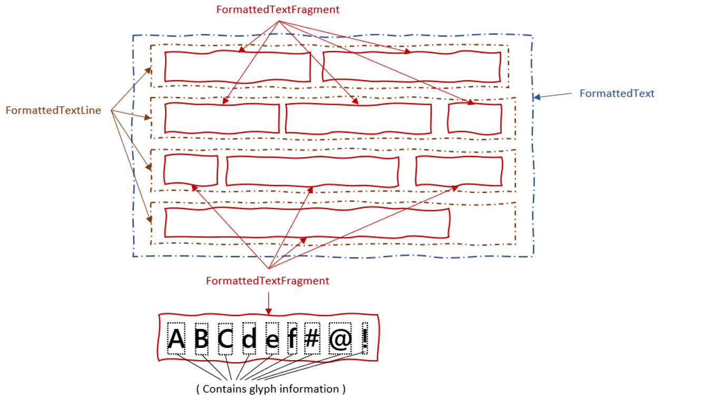

# Formatted Text - Metrics

A representation of post-layout metrics for inline layout content, in particular the
metrics from the formatted text data model.

This explainer focuses on the metrics that are offered for inline text content, in particular
the data model for formatted text. We aspire to create these metrics in a way that allows them
to be supported for other sources of inline text content, in particular the DOM or a Worklet's
Layout API algorithm.
Additional scenarios include different web application rendering systems which can make use of
the text shaping information to perform their own rendering logic. For example WebGL based apps 
with text content. The metrics would be used to determine how to correctly position glyphs in a
typographically correct manner.

We took extensive inspiration from the [Text API explainer](https://github.com/google/skia/blob/main/site/docs/dev/design/text_overview.md),
and the use cases supporting the rendering of glyphs as described therein, as well as the
notion of a Position object.

For a general overview of the feature, see the repo's [readme](README.md).
You can also learn more about the [formatted text data model](explainer-datamodel.md) and 
[how to render it](explainer-rendering.md).

# Use cases

## Peparing text for rendering: from gross placement needs to fine-grained glyph control

### Use case: paragraph placement

This use case is the most basic use case we can imagine--identifying the placement of some
Formatted Text into a view layer (like Canvas). Placement needs two things, a reference 
coordinate (x/y) and size metrics (bounding box of width/height).

Author provides: 

* input `FormattedText` object (including styled runs, where styles may include runs with
   differing font characteristics, line-spacing, justification rules, etc.) 
* line-wrap constraints (width constraint in horizontal languages) 

Metrics provide: 

* Final shaped and formatted paragraph width and height. 

A rendering API must provide: 

* (x, y) location to place the formatted paragraph. (Authors ensure paragraph will fit in 
   the space provided by their data model. If not, they can adjust font-size, line-width, 
   line-spacing, etc., on the original `FormattedText` objects and re-request metrics until
   the desired goal is met.

### Use Case: line placement

In this case, the author would like the platform to calculate line wrapping, but intends to
render each line iteratively (such as for captions), or with custom spacing, etc.

Author provides same information as above. 

Metrics provide: 
* Access to formatted line objects with width and height (including their offsets from the
   paragraph container)
* Pointers back to the input characters for the bounds positions of each line.

A rendering API must provide: 

* (x, y) location to place formatted line 

### Use Case: specific glyph placement

⚠🚧 We would like to validate this use case for Canvas 2D scenarios. For WebGL scenarios, we
understand the key information needed for rendering is the given shaped font's glyph id and
glyph advance information. Is a Canvas 2d rendering API needed? A sketch of how this might 
work follows.

Author provides same information as in the previous use case. 

Metrics provide: 

* List of Shaped Glyph metrics per fragment (fragment is a unit of glyphs that all share the
   same format/font/bidi/etc.). 
* Pointers back to the input characters for each glyph's bounds. 

A rendering API must provide:

* (x, y) location to place a glyph, given a Fragment (holder of glyph's shaped information),
   and glyph info (index within that fragment or ID within the font)

## Editing scenarios for inline text

Many of the scenarios behind the chosen metrics are based on common editing use cases. An editing
surface must provide a visual view and the means to move insertion points, selection ranges, etc.,
by responding to various input including pointing devices and keyboard. In order to support these
input modalities, the metrics supplied by the explainer chiefly provide the means of understanding
the relationships between parts of text as it was laid out (the glyphs that make up segments of
like-formatted runs called "fragments" in this proposal, lines, etc.) and the relatiionship between
these metrics and their source `FormattedText` objects.

### Rendering a selection over text (and placing/moving a caret)

Author provides: 

* Input data model (same as previously described). 
* JS objects for tracking selection anchor and focus locations in the input data model (i.e., 
   reference to a `FormattedTextRun` and character offset).

Metrics provide:

* Position objects that map line/fragment/glyph indexes to input data model runs/offsets.
   (Map from text metrics to data model.)
* API for obtaining position objects given input data model runs/offsets. (Map from 
   data model to text metrics.)
* API for obtaining position objects given (x,y) offsets relative to the formatted paragraph.
   (Map for mouse/touch/pen input to text metrics and data model.)
* Access to formatted line objects with width/height (bounding box) and offsets from their
   container. 
* Access to formatted fragments within lines with width/height (bounding box) and offset from
   their container (if a selection needs to be tightly bound around the formatted glyph runs
   inside of lines).
* Access to glyph width/height (bounding box) and offset from the fragment container. 

A rendering API does not need to provide specific features (other than those noted in previous 
use cases) for this scenario. (e.g., rendering a selction and caret can be done with existing
APIs).

# Overview: data model to metrics to rendering

The [data model](explainer-datamodel.md) itself cannot be rendered to a canvas as-is. We
experimented with the idea of directly-rendering a `FormattedText` object, and found that in
nearly every scenario the author needed to know both the expected width (i.e., inline-size) and
the resultant height (i.e., block-size) in order to place the formatted content properly in the
canvas.

As is the case with HTML text in normal flow, vertical positioning options for paragraphs of text
are limited. CSS Flex and Grid now offer the desired alignment properties, however, it is not our
goal to introduce these new CSS layout models to `FormattedText`. Instead, we will let authors
calculate the placement of the formatted text themselves. To do this, the metrics API will provide
both the inline and **block size** values.

In order to get the data model's inline and block size, the `FormattedText` object must be… well, 
formatted.

A new API is added to the `FormattedText` object: **format()**. This API takes a maximum inline size 
parameter and asynchronously returns a **formatted paragraph object** containing the inline size and
block size (among other things) after running all shaping, line breaking, and formatting of the text.
This paragraph object **is a snapshot** of metrics for the `FormattedText` data model, given the
constraints applied at the time of formatting, and is **not updated** as additional changes are made
to the data model.

The formatted paragraph is a container for all the input data model's metrics. It contains the APIs 
to get additional line, fragment, and glyph information. The object hierarchy is shown below (note
the image shows lines in a horizontal writing mode--but vertical writing modes are supported):

These objects (that contain a snapshot of metrics and layout information) may be rendered independently.
We suggest APIs to render the entire paragraph, a single line, or (needs validating) any sequence of
glyphs from a fragment (see [Rendering section](explainer-rendering.md)).

| New APIs on `FormattedText` | Description |
|---|---|
| .`format`(`inlineSize`) | Asynchronously formats the `FormattedText` object, returning an object suitable for rendering and extracting metrics: a `FormattedTextParagraph` |

## Metrics lifetime expectations

⚠🚧 We encourage prototyping to get feedback about the implementation opportunities or complexities 
of this suggested approach.

It seems likely that developers will want to `format` their `FormattedText` frequently (for example, 
as the model is changed to respond to user actions). Because metrics objects are snapshots, this 
could lead to an accumulation of many copies of metrics, only the most recent of such is relevant to
the latest data model udpates at any given time. One approach, to avoid unnecessary pressure on the 
garbage collector, is to return the same instance of one or all of the metrics objects each time
`format` is called. If a portion of the metrics have changed, then the objects related to those 
metrics would be new instances, while the other unchanged metrics would be same-instance identical.

A downside to this approach is that authors wouldn't necessarily be able to depend on getting back
the same object identity all the time. For example, JavaScript properties added to a line object might
"stick" on that object only as long as the same instance is returned from the API. Once a "new" object
is returned, the author's extra JavaScript properties will be missing.

Our recommendation is a hybrid approach. New objects shall be created every time `format` is called.
This allows us to provide clear author expectations. However, to allow implementations to optimize, 
only **one copy** of the metrics objects (the one most recently returned from `format`) will be 
"operable" at any one time. Prior copies of metrics objects will be internally disabled such that API
calls on them will throw exceptions.

## Thinking ahead: future integration into DOM or Houdini Layout API

⚠🚧 WARNING: This section is entirely speculative, and out of scope for now. We include it here 
to ponder extended use cases in which these metrics could be applicable in the wider web platform.
(And not to lose track of them in the design process.)

The opportunity to get detailed metrics for formatted text is not exclusively tied to scenarios 
where DOM is potentially unavailable or impractical to use. We would like to ensure that we design
for the possibility of integration into both DOM and Layout API scenarios as well.

We envision APIs similar to `format()`, that could also extract formatted text metrics. For DOM,
a given `Node` already has a layout (when attached to the tree) that includes a Layout box model,
and so a similar `format` call would not require specifying an inline-size constraint. Instead,
something like `measureFormattedText()` would operate at \[some scope] and return the formatted
text metrics for that scope. A more scoped set of metrics could be returned by extending a similar
existing API [`getClientRects()`](https://drafts.csswg.org/cssom-view/#dom-element-getclientrects)
with line metric information.

In the Layout API, while processing a `layout`, `LayoutFragment` objects can represent a line of text.
In these situations, it might make sense to extend the `LayoutFragment` by combining it with a 
`FormattedTextLine` metrics object. This would provide extra information about the intra-line fragments
and glyph information, potentially allowing advanced positioning of glyphs within a line-layout pass.

| ⚠🚧 Ideas for integration into other parts of the platform | Description |
|---|---|
| myElement.`measureFormattedText`() | Similar to `format`. TBD on scope of how this would work 😊 |
| `extDOMRect`.`textFragments`[`i`] | Alternative DOM integration point that extends `getClientRects()` such that each rectangle gets the `FormattedTextLine` mixin or some such. | 
| `extLayoutFrag`.`textFragments`[`i`] | Array of `FormattedTextFragments` (see equivalent functionality in a `FormattedTextLine` object). |

# Formatted text metrics objects

## Paragraphs - `FormattedTextParagraph`

This is the top-level container returned by formatting a FormattedText object. It provides:

* width/height.
* array of Line objects.
* a coordinate system for its lines (see section below).
* Utility function for getting a position from a character and text run in the data model (position
   objects described below).
* Utility function for getting a position from an x/y coordinate pair (where the x/y coordinates 
   should be relative to the paragraph's coordinate system.

| APIs on `FormattedTextParagraph` | Description |
|---|---|
| .`inlineSize` | Returns the bounding-box size in the inline direction or width for horizontal writing modes (double) |
| .`blockSize` | Returns the bounding-box size in the block direction or height for horizontal writing modes (double) |
| .`lines`[] | An array of `FormattedTextLine` objects |
| .`getPosition`(`textrun`, `offset`) | Given the "source object" (intentionally generic: could be extended to support `Text` in the future), and an offset, returns a `FormattedTextPosition` of the associated glyph (if any). If no glyph for that character, returns `null`. |
| .`getPositionFromPoint`(`x`,`y`,`findNearest`) | For mapping pointer positions into glyphs. `findNearest` might ensure that a `FormattedTextPosition` is always returned regardless of the coordinate value, whereas otherwise, `null` might be returned if not strictly over a glyph. |

### Thoughts on coordinate systems

This API is designed with multiple writing modes (i.e., horizontal and vertical text) in mind. To 
an author used to `ltr` direction and `horizontal-tb` block progression, having coordinates originate
in the upper-left of some object's bounding box makes sense. We assert that in other writing modes
the coordiante origin should align with the expectations of that layout mode. For example, if the 
inline direction is top-to-bottom, starting at the right edge with block progression growing to the
left, then the coordinate origin makes more sense in the upper-right of an object's bounding box. It
is our intent then that when expressing coordinate positions, the origin is relative to the defined 
(or implied) writing mode used in the `FormattedText` object.

We acknowledge that the Canvas coordinate systems (e.g., 2d canvas and WebGL) are fixed, meaning that
some writing modes, such as the `vertical-rl`, might need to perform a translation when rendering the
formatted text objects into a canvas.

We also considered **relative coordinate systems** for each "layer" of the nested objects in the
formatted text metrics. For example, fragments inside of lines would have coordinate offsets that were
**relative** to the line's origin. Such an approach only tends to add complication for authors who 
will need to compute absolute offsets when working outside of the formatted text metrics (for example,
in a canvas while responding to pointer events). For this reason, offset information at every step of
the metrics API are **absolute** offsets from the origin of the formatted text paragraph (with one 
exception: glyph advances).

Using abolute offsets for every object may need to be revisited when considering metrics reported only
for paragraph sub-parts (e.g., in the Layout API where there may be no paragraph objects available).

For glyphs, the most vital piece of information for determining the position of the following glyph (in
either horizontal or vertical orientation) is the `**advance**`. The value of `advance` is always 
relataive for each glyph, and has already incorporated kerning for adjacent glyphs.

## Positions – `FormattedTextPosition`

Inspired by the
[TextPosition](https://github.com/google/skia/blob/main/site/docs/dev/design/text_shaper.md#access-the-results-of-shaping-and-formatting)
design, a `FormattedTextPosition` object provides the mapping between the formatted snapshot of the data
model (e.g., the paragraph, lines, fragments and glyphs) and the data model itself, which contains the 
source characters (Unicode code points) and their CSS-styled text runs. Positions always connect glyphs
with characters and contain all necessary indexes to navigate the object structures to get between glyphs
and characters. Like the rest of the formatted objects, positions are snapshots, and not updated as the
model changes. (So don't change the model until you're done using a `FormattedTextPosition`!)

To find the relevant character(s) in the data model, positions have:

* `FormattedTextRun` object reference (one-way reference)
* Character offset (start and end) since some glyphs are formed from a sequence of characters
   (Unicode combining characters, ligatures, etc., which vary by Font).

To find the relevant glyph in the metrics objects, positions have:
* Line index (within the paragraph)
* Fragment index (within the line)
* Glyph index (within the fragment)

There are some interesting cases to explore when it comes to Glyph mapping from source characters.
These are covered below in the fragments section.

| APIs on `FormattedTextPosition` | Description |
|---|---|
| .`source` | A reference to the `FormattedTextRun` that contains the relevant character(s). The term `source` is generic in order to potentially support `Text` nodes as well in the future. |
| .`characterOffsetStart` | The offset (unsigned long) within `source` that the associated glyph derives from (the start of the range if more than one character). |
| .`characterOffsetEnd` | See above. If only one character maps to a single glyph, the start and end offsets will be the same. |
| .`lineIndex` | The index into the `FormattedTextParagraph`'s `lines` array where the associated glyph can be found. |
| .`fragmentIndex` | The index into the `FormattedTextLine`'s `textFragments` array where the associated glyph can be found. |
| .`glyphIndex` | The index into the `FormattedTextFragment`'s `glyphs` array where the associated glyph can be found. |

## Lines – `FormattedTextLine`

The line is the bounding box of all the formatted fragments contained within the line (it has no 
formatting itself). All fragments contained within the line are wholly contained within (no fragments 
exist simultaneously in multiple lines). Note: due to justification or other inline alignment properties
of the line, the line sizes and offsets may vary. The line's offsets are relative to the origin of its
parent `FormattedTextParagraph` object.

The line provides:

* width/height (bounding box)
* x/y offsets from the paragraph origin
* array of `FormattedTextFragment` objects.
* ⚠🚧TODO: add dominant baseline information?
* Utility functions for getting the start position and end position of the characters that bookend
   the line (e.g., the ability to identify where the line starts and ends in the data model)

| APIs on `FormattedTextLine` | Description |
|---|---|
| .`inlineSize` | Same as `FormattedTextParagraph` definition. |
| .`blockSize` | Same as `FormattedTextParagraph` definition. |
| .`inlineOffset` | Returns the inline-direction offset from the `FormattedTextParagraph` origin or x-coordinate for horizontal writing modes (double) |
| .`blockOffset` | Returns the block-direction offset from the `FormattedTextParagraph` origin or y-coordinate for horizontal writing modes (double) |
| .`textFragments`[] | An array of `FormattedTextFragment` objects. |
| .`getStartPosition`() | Returns a `FormattedTextPosition` of the glyph forming the "start" end of the line (left side for horizontal LTR). |
| .`getEndPosition`() | Returns a `FormattedTextPosition` of the glyph forming the "end" of the line (right side for horizontal LTR). |

## Fragments – `FormattedTextFragment`

The fragment is the smallest unit of same-formatted text in a line. Fragments always have consistent 
directionality (they are post-BIDI algorithm processed, where alternating bidi sequences are split 
into separate fragments). All glyphs within have the same font shaping properties applied. Because
of these properties, the fragment metrics are quite similar to the information exposed through 
[`measureText()`](https://html.spec.whatwg.org/multipage/canvas.html#dom-context-2d-measuretext).
Consequently, the `FormattedTextFragment` extends the 
[`TextMetrics`](https://html.spec.whatwg.org/multipage/canvas.html#textmetrics) interface.

The fragment also holds all the glyph information. The glyph information is to be understood in the
context of the fragment's format (its font metrics).

Note: the `FormattedTextFragment` and future 
[Font Metrics API](https://drafts.css-houdini.org/font-metrics-api/#fontmetrics) could be combined,
though in this context the fragment is guaranteed to have consistent font metrics, so things like 
the FontMetrics' `fonts` (a list) wouldn't apply.

A Fragment object provides:
* width/height
* x/y offsets (from the paragraph's coordinate origin)
* Everything on HTML's
   [`TextMetrics`](https://html.spec.whatwg.org/multipage/canvas.html#textmetrics) interface
* ⚠🚧 Formatting result values (for font, etc.). Note: we would like to understand the use cases 
   for some of these better.
* Array of glyph information
* ⚠🚧 Potentially add baseline information (relative to the line) depending on use case?
* Utility functions for getting the start position and end position of the characters that bookend 
   the fragment (e.g., the ability to identify where the fragment starts and ends in the data model).
* Utility function for getting a position for an arbitrary glyph in the fragment

| APIs on `FormattedTextFragment` | Description |
|---|---|
| .`inlineSize` | Same as `FormattedTextParagraph` definition. |
| .`blockSize` | Same as `FormattedTextParagraph` definition. |
| .`inlineOffset` | Same as `FormattedTextLine` definition. |
| .`blockOffset` | Same as `FormattedTextLine` definition. |
| .`glyphs`[] | An array of dictionary objects containing glyph info (see next section). |
| .`getStartPosition`() | Returns a `FormattedTextPosition` of the glyph forming the "start" end of the fragment (direction-dependent). |
| .`getEndPosition`() | Returns a `FormattedTextPosition` of the glyph forming the "end" of the fragment (right side for horizontal LTR). |
| .`getGlyphPosition`(`index`) | Returns a `FormattedTextPosition` for the glyph at the given index (in the glyphs array). |
| APIs from [`TextMetrics`](https://html.spec.whatwg.org/multipage/canvas.html#textmetrics) | `width` (total advance width for the fragment; duplicate of `inlineSize` for horizontal writing modes), `actualBoundingBoxLeft`, `fontBoundingBoxAscent`, etc. |
| Formatting result information (fragment specific) | ⚠🚧 To discuss use cases for this data (and how to protect it for installed fonts `fontFamily`, `fontSize`, `direction`, `writingMode`). |

### Fun with source characters and glyph mappings

To form glyphs, font files have processing rules that are font-specific that determine how
characters are mapped to particular glyphs. The presentation of a glyph may be processed differently
depending on the font. For base ASCII characters the mapping is typically trivial--one character is
associated with one glyph. However, for combining characters (and similar), font behavior may vary.
For example, a font may map `á` (U+00E1 Latin Small Letter A with Acute) to a single glyph geometry 
(statically or through a processing table). Another font might cause two glyphs (the decomposition of
the glyph `á` into `a` U+0061 Latin Small Letter A and `◌́ ` U+0301 Combining Acute Accent) to be used
and will alter the advance logic so that the comining character glyph is painted in the same
location as the `a`.

⚠🚧 We expect that additional experimentation is required to work out the best API given the range of
possibilities and font combinations that exist.

Our early thoughts are to model all cases where multiple glyphs are used for combining characters 
as unique fragments. Thus, within a fragment we can assert that the set of glyphs with will always
have positive advances. When a combining character (or string of them) is encountered, such a character
would be placed into its own fragment object, and the offset of that fragment would overlap the previous
fragment.

In cases where combining characters result in a single glyph, the API is designed to naturally express
a `FormattedTextPosition` that includes the start and end range of the contributing characters.

## Glyphs – JS Object (dictionary)

Plain JS object with keys/values:

* advance – to be understood in the writing mode direction.
* id - this glyph's font-specific index code (into the font). May be `null` for installed fonts.

⚠🚧 There are lots of interesting metrics for glyphs; however, we'll want to understand use cases
that necessitate exposing more information (e.g., `x`/`y` origin, `bearing`, bounding box geometry, 
applied kerning, actual geometry like Path2D data, raw `ImageData`, etc.). Modeling a glyph with a 
JavaScript object allows for easy extensibility. Alternatively, with only `advance` and `id`, this
information could be expressed as arrays.

## Additional Accessibility Considerations for Metrics

**Word bounds/breaks** - meta-data about "word" breaks opportunities are not exposed to the developer
today. In the current propsoal, the identification of word breaks is left as an activity to be
supported by author code. Note that word-breaking for the purpose of line wrapping and formatting
is in scope for this feature. However once the layout has been calculated, author code will need 
to use heuristics in langugues that have natural word breaks (e.g., via spaces between words). 
Developer feedback on whether native metrics should be support for word-breaks is sought and may
motivate additional work.

## Contributors:
 [sushraja-msft](https://github.com/sushraja-msft),
 [travisleithead](https://github.com/travisleithead)
