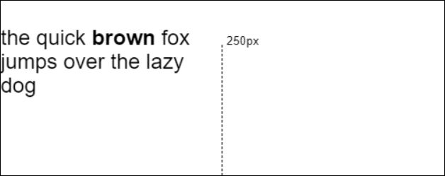

Formatted Text - Rendering
=============
An approach to rendering multi-line formatted text to an HTML canvas context.

This explainer focuses on rendering [the data model](explainer-datamodel.md) for formatted text.
For a general overview of the problem space, see the repo's [readme](readme.md). In addition to rendering,
the data model can [provide metrics](explainer-metrics.md).

---
## Specifying the layout constraints

## Initial values for CSS properties, esp. when used with the Canvas. Who wins?

## CSS unit value resolution (percentages, px, vh, etc.)


Next, to render the text into multiple lines, we use the new `fillFormattedText` API
which takes a max width to wrap the text at.

```js
context.font = "18pt Arial";
context.fillFormattedText( formattedText, /*x*/0, /*y*/50, /*wrapWidth*/250 );
```

This would produce the following output on the canvas:



### Bidi Text

No additional work is needed from web developers to support bidi text.
Implementations will perform bidi analysis on the `CanvasFormattedText`'s text runs
and create internal bidi runs if necessary. An example demonstrating bidi text follows:

```js
const context = document.getElementById( "myCanvas" ).getContext( "2d" );
context.font = "30px Arial";
let canvasFormattedText = new CanvasFormattedText();
canvasFormattedText.appendRun( { text: "Sample arabic بمدينة مَايِنْتْس، ألمانيا text." } );
context.fillFormattedText( canvasFormattedText, /*x*/0, /*y*/30, /*wrapWidth*/350 );
```

produces the following output on the canvas:


### Pre-existing text controls

The other text styles `textAlign`, `textBaseline` on the canvas context control justification
and baseline alignment of the multiline text relative to provided x/y coordinates.

CSS styles on the canvas element affect text rendering. These CSS properties are

- `line-height` - Specifies height of a line.
- `direction` - Sets the initial direction for bidi analysis.
- `word-break` / `word-wrap` - Controls break opportunities for text wrapping.


## WebIDL

```webidl
partial interface CanvasText { 
  // Perform layout and render FormattedText
  void fillFormattedText(FormattedText formattedText, 
                         double x, 
                         double y, 
                         double inlineSize, 
                         optional FormattedTextOptions options); 

  void strokeFormattedText(FormattedText formattedText, 
                           double x, 
                           double y, 
                           double inlineSize, 
                           optional FormattedTextOptions options); 
}; 
 
// Dictionary for future extensibility for layout/canvas integration features
dictionary FormattedTextOptions { 
  double blockSize;
}; 
```

## Accessibility Considerations for Rendering

As a potential render target for `FormattedText`, the canvas itself is a persistant challenge for 
accessibility on the web today. Several efforts are underway, including a
[promising solution](https://github.com/WICG/aom/blob/gh-pages/explainer.md#use-case-4-adding-non-dom-nodes-virtual-nodes-to-the-accessibility-tree)
as part of the Accessible Object Model (AOM) family of proposals.

Meanwhile, web developers are encouraged to use the canvas element's fallback content
to provide HTML markup that describes the canvas' current state until or unless a better
solution that utilizes the `FormattedText` directly is established. For now, the aggregate 
text of a `FormattedText` object's text runs should be placed in block-styled
[flow content](https://html.spec.whatwg.org/multipage/dom.html#flow-content-2) (such
as a `<p>` element), with formatted sections wrapped in appropriate
[phrasing content](https://html.spec.whatwg.org/multipage/dom.html#phrasing-content-2)
(such as `<span>` and styled to match the `FormattedTextRun` formatting.) The
markup should make use of
[ARIA Live Regions](https://developer.mozilla.org/en-US/docs/Web/Accessibility/ARIA/ARIA_Live_Regions)
to be sure assistive technologies (ATs) detect and announce any dynamic changes.

## Metrics for FormattedText and layout calculations
The [metrics explainer](explainer-metrics.md) describes how to take the data model 
representation of formatted text and extract metrics for relating the laid-out text 
back to the formatted text data model.

## Contributors:
 [sushraja-msft](https://github.com/sushraja-msft),
 [travisleithead](https://github.com/travisleithead)
